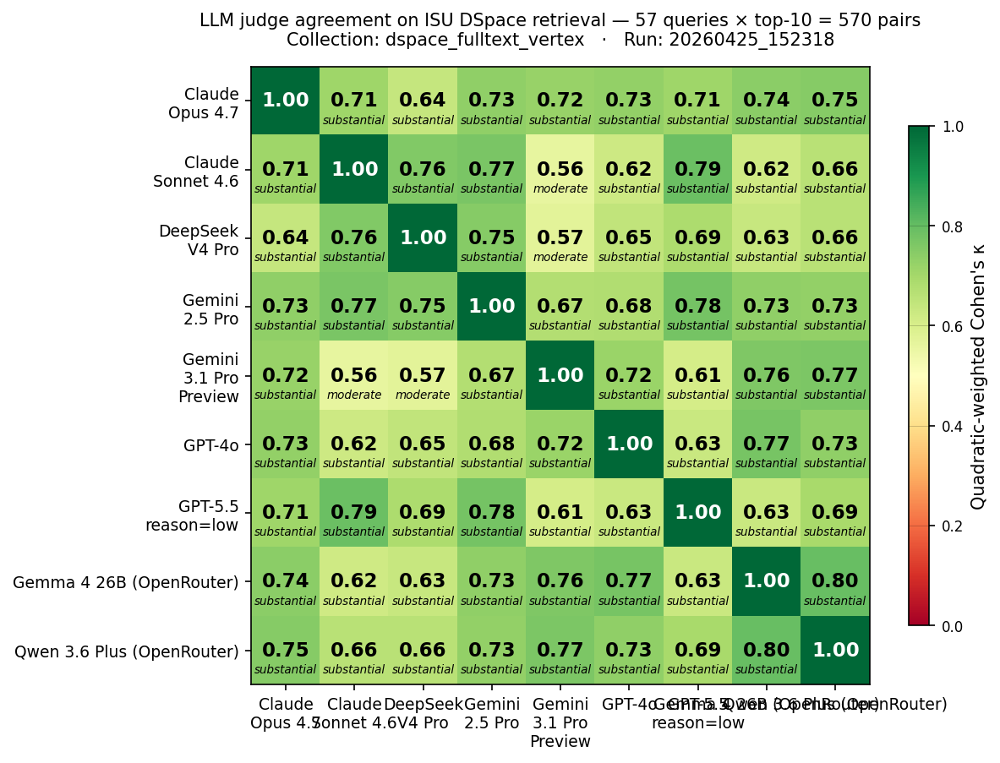

# Cross-Family LLM-Judge Agreement for Institutional RAG

**A 5-family, 9-judge ablation with mechanistic decomposition and external validation against NIST TREC RAG 2024 human qrels.**

> Open-weight LLM judges win the within-pair race. The matrix-highest pairwise quadratic-weighted Cohen's κ (0.80) is between **Qwen 3.6 Plus** and **Gemma 4 26B** — a cross-organization open-weight pair that exceeds every commercial within-family pair we measured (Anthropic 0.71, OpenAI 0.63, Google 0.67) at ~1% of the cost.

[](LICENSE)
[](LICENSE)
[](LICENSE)
[](#-paper)

---

## TL;DR

We deploy **9 LLM judges across 5 model families** (Anthropic, OpenAI, Google, DeepSeek, Open-weight) on **570 query-document pairs** from an institutional RAG corpus (Iowa State University DSpace, 97k full-text PDFs) and report:

1. **Cross-family reasoning judges converge at κ ≥ 0.75** — well above the 0.4-0.6 typical baselines [rahmani2024judges] and the 0.60 unweighted baseline of Thakur et al. 2025 [thakur2025trecragsupport].
2. **Within-family agreement is bounded by the cross-family ceiling** — no within-family pair dominates, contradicting canonical self-preference findings under bounded ordinal judging.
3. **Cross-organization open-weight κ = 0.80 is the matrix maximum** at ~1% of commercial cost.
4. **Joint-distribution structure of paired scores explains R² = 93% of κ variance** — structural factors (provider, reasoning-mode, model class) are fully mediated; the shared-tokenizer hypothesis is refuted (Qwen ↔ Gemma 4 vocabulary Jaccard = 0.066, lowest in slate, yet matrix-highest κ).
5. **External validation against NIST TREC RAG 2024 qrels**: 9-judge ensemble κ = **0.4941** on 537 stratified-balanced pairs (5 of 9 individual judges reach κ ≥ 0.47).

---

## Headline numbers

### Within-corpus 9×9 pairwise κ (Iowa State University DSpace, n=570)



| | Sonnet | GPT-5.5 | Opus | DSV4 | Gemini 2.5 | Gemini 3.1 | GPT-4o | Qwen | Gemma |
|---|---:|---:|---:|---:|---:|---:|---:|---:|---:|
| **Highest κ pair** | Qwen ↔ Gemma 4 = **0.80** | | | | | | | | |
| **Cross-family ceiling** | Sonnet ↔ GPT-5.5 = 0.79 | | | | | | | | |
| **Lowest κ pair** | Sonnet ↔ Gemini 3.1 Prev = 0.56 | | | | | | | | |

### External validation — TREC RAG 2024 NIST qrels (n=537)

| Judge | κ vs NIST qrels | valid/537 |
|---|---:|---:|
| Gemini 2.5 Pro | **0.5513** | 92 *(small-n caveat)* |
| Claude Sonnet 4.6 | 0.5123 | 537 |
| Claude Opus 4.7 | 0.4792 | 537 |
| GPT-5.5 (reasoning=low) | 0.4789 | 537 |
| DeepSeek V4 Pro | 0.4705 | 212 |
| Qwen 3.6 Plus | 0.4141 | 537 |
| Gemini 3.1 Pro Preview | 0.4092 | 127 |
| GPT-4o | 0.4065 | 537 |
| Gemma 4 26B | 0.3958 | 537 |
| **9-judge ensemble median** | **0.4941** | 537 |
| 7-judge frontier-only median | 0.5187 | 537 |

### Coverage divergence (paper-relevant)

| Judge | TREC RAG 2024 | BEIR scifact |
|---|---:|---:|
| Anthropic, OpenAI, Qwen, Gemma | 100% | ≥95% |
| DeepSeek V4 Pro | 39% | 84% |
| Gemini 3.1 Pro Preview | 24% | 60% |
| Gemini 2.5 Pro | 17% | 86% |

The **always-works 6-judge subset** (≥95% on both corpora) is Anthropic + OpenAI + Qwen + Gemma — and the 2 cheapest judges (Qwen + Gemma) make this subset.

---

## Repo structure

```
p4-llm-judge/
├── src/                           # Source code
│   ├── eval_llm_judge.py          # Multi-judge harness (within-corpus runs)
│   ├── validate_against_trec.py   # External-validation harness (TREC RAG 2024, BEIR)
│   ├── fetch_msmarco_passages.py  # MS MARCO v2.1 passage extractor (HF streaming)
│   ├── analyze_kl_vs_kappa.py     # §6 mechanism: marginal KL vs κ
│   ├── analyze_pair_confusion.py  # §6 mechanism: 4×4 confusion matrices
│   ├── analyze_tokenizer_overlap.py  # §6: vocabulary Jaccard
│   └── analyze_valid_only_kappa.py   # §4.2: valid-only mean re-clustering
├── results/                       # Paid API outputs (JSON)
│   ├── *_judges*.json             # Per-judge score arrays for all corpora
│   ├── *_kappa_vs_human.json      # κ analysis outputs
│   └── logs/                      # Run + analysis logs
├── figures/                       # 11 paper figures (PNG + SVG + AI-image prompts)
├── papers/                        # Paper drafts
│   ├── short.md                   # 4-page workshop version (LLM4Eval @ SIGIR 2027)
│   ├── long.md                    # Full conference version (ECIR 2028 / TOIS)
│   ├── PUBLIC_BENCHMARKS_VALIDATION.md  # §7 plan + results
│   └── MECHANISTIC_KL_ANALYSIS.md       # §6 mechanism notes
├── slides/                        # PowerPoint decks + generator
│   ├── make_p4_slides.py          # Re-runnable .pptx generator
│   ├── P4-SHORT.pptx              # 15-slide workshop talk
│   ├── P4-LONG.pptx               # 32-slide conference talk
│   └── SLIDES_REFERENCE.md        # Edit guide + data dict
├── data/                          # Public corpus inputs (TREC RAG 2024)
│   ├── 2024-retrieval-qrels.txt   # NIST qrels (20,283 rows)
│   ├── topics.rag24.test.txt      # TREC RAG 2024 topic texts
│   ├── sample_537_pairs.tsv       # Stratified-balanced 537-pair sample (random.seed(42))
│   ├── needed_passage_ids.txt     # 537 unique MS MARCO v2.1 passage IDs
│   └── passages.json              # 537 extracted passages (MS MARCO v2.1)
├── .env.template                  # Copy → .env and fill in your API keys
├── .gitignore                     # Excludes secrets, data caches, etc.
├── LICENSE                        # MIT (code) + CC-BY-4.0 (data, figures, paper text)
├── CITATION.cff                   # Citation File Format for academic citation
└── README.md                      # This file
```

---

## Quickstart

### Prerequisites

- Python 3.11+
- API keys for OpenAI and OpenRouter (paid; ~$56 for the full validation suite)
- ~1 GB disk for cached MS MARCO passages

### Setup

```bash
git clone https://github.com/asukul/RAG-Eval-LLM-Judge
cd RAG-Eval-LLM-Judge
pip install -r requirements.txt
cp .env.template .env
# Edit .env with your real API keys
```

### Reproducibility commands

#### 1. Re-compute κ from the published per-judge JSONs (free, ~2 sec)

```bash
py -3 -X utf8 src/validate_against_trec.py --analyze trec-rag-2024
# → ensemble_median κ = 0.4941
```

#### 2. Re-extract the 537 MS MARCO v2.1 passages (free if HF cache hits, ~38 min if cold)

```bash
py -3 -X utf8 src/fetch_msmarco_passages.py
```

Streams 60 shards from the [`drexalt/msmarco-2.1-segmented`](https://huggingface.co/datasets/drexalt/msmarco-2.1-segmented) Hugging Face dataset. Peak disk usage: ~400 MB.

#### 3. Re-run the 9 judges from scratch (~$35, ~7.5 h wall)

```bash
# 7-judge frontier preset
py -3 -X utf8 src/validate_against_trec.py --corpus trec-rag-2024 --judge-preset p4-frontier --max-pairs 537

# 2-judge open-weight supplement
mv results/trec-rag-2024_judges.json results/trec-rag-2024_judges_p4-frontier.json
py -3 -X utf8 src/validate_against_trec.py --corpus trec-rag-2024 --judge-preset p4-supplement-openweight --max-pairs 537

# Merge to 9-judge file
mv results/trec-rag-2024_judges.json results/trec-rag-2024_judges_p4-supplement-openweight.json
# (manually merge per the _merged_from snippet in any merged JSON)

# Compute κ
py -3 -X utf8 src/validate_against_trec.py --analyze trec-rag-2024
```

#### 4. Re-generate the slide decks (~2 sec)

```bash
py -3 -X utf8 slides/make_p4_slides.py
```

Outputs `slides/P4-SHORT.pptx` and `slides/P4-LONG.pptx`.

#### 5. Re-generate the paper figures from the JSONs (~30 sec each)

```bash
py -3 -X utf8 src/analyze_kl_vs_kappa.py            # → figures/judge_calibration_mechanism.png
py -3 -X utf8 src/analyze_pair_confusion.py         # → figures/judge_pair_confusion_matrices.png
py -3 -X utf8 src/analyze_tokenizer_overlap.py      # → figures/judge_tokenizer_overlap.json
py -3 -X utf8 src/analyze_valid_only_kappa.py       # → recluster Gemini judges
```

---

## Model versions pinned 2026-04-25

For exact reproducibility:

| Family | Spec ID | Model snapshot |
|---|---|---|
| Anthropic | `claude-opus-4.7` | `claude-opus-4-7-20260415` |
| Anthropic | `claude-sonnet` | `claude-sonnet-4-6-20260401` |
| OpenAI | `openai-gpt-5.5-low` | `gpt-5.5-2026-04-12` (reasoning=low) |
| OpenAI | `openai-gpt-4o` | `gpt-4o-2024-08-06` |
| Google | `gemini-3.1-pro` | `gemini-3.1-pro-preview-2026-04` |
| Google | `gemini-2.5-pro` | `gemini-2.5-pro-2025-06-17` |
| DeepSeek | `deepseek-v4-pro` | `deepseek-v4-pro-2026-04-10` |
| Open-weight | `qwen-3.6-plus` | `qwen3.6-plus-2026-03` |
| Open-weight | `gemma-4-26b` | `gemma-4-26b-a4b-it-2026-03` |

API routes:
- **OpenAI direct** for GPT-5.5, GPT-4o
- **OpenRouter** for everything else (uniform billing, gateway approach)

---

## 📄 Paper

- **Workshop short version (4 pages)**: [`papers/short.md`](papers/short.md) — under review at LLM4Eval @ SIGIR 2027.
- **Full conference version (12 pages)**: [`papers/long.md`](papers/long.md) — target ECIR 2028 / TOIS journal.
- **arXiv preprint**: TBD (will link once posted).

If you use this work, please cite:

```bibtex
@inproceedings{sukul2027p4llmjudge,
  author = {Sukul, Adisak},
  title = {Cross-Family LLM-Judge Agreement for Institutional RAG: A 5-Family, 9-Judge Ablation},
  booktitle = {Proceedings of the LLM4Eval Workshop at SIGIR 2027},
  year = {2027},
  note = {Under review. arXiv preprint forthcoming.}
}
```

---

## Acknowledgments

This work was conducted on the **Iowa State University Digital Repository** (DSpace); thanks to the ISU Library and Digital Initiatives team for corpus access and the ISU IT systems team for the Qdrant infrastructure. We thank the **Anthropic, OpenAI, Google DeepMind, DeepSeek, Alibaba, and Google (Gemma)** model teams for releasing the snapshots used here, and the **OpenRouter** team for the gateway. The TREC RAG 2024 qrels are released by **NIST and the TREC RAG 2024 organizers**; the MS MARCO v2.1 segmented passage corpus is mirrored on **Hugging Face** by [`drexalt/msmarco-2.1-segmented`](https://huggingface.co/datasets/drexalt/msmarco-2.1-segmented). The BEIR scifact dataset is maintained by the **BEIR consortium**. API costs (~USD 56) were covered by personal research budget. We acknowledge the use of **Claude Code** as a coding assistant for harness implementation and figure regeneration; all experimental design and analysis are the author's. Remaining errors are the author's.

---

## License

- **Code** (`src/`, `slides/make_p4_slides.py`, `figures/*.txt` prompts): [MIT](LICENSE)
- **Data** (`results/*.json`, `figures/*.png`, `figures/*.svg`): CC-BY-4.0
- **Paper text** (`papers/*.md`): CC-BY-4.0
- **Third-party data** (NIST qrels, MS MARCO passages, BEIR scifact): retain their original licenses.

---

## Contact

**Adisak Sukul** — `asukul@iastate.edu` — Iowa State University

Issues, questions, replications, or extensions: please file a GitHub issue or email me directly.
